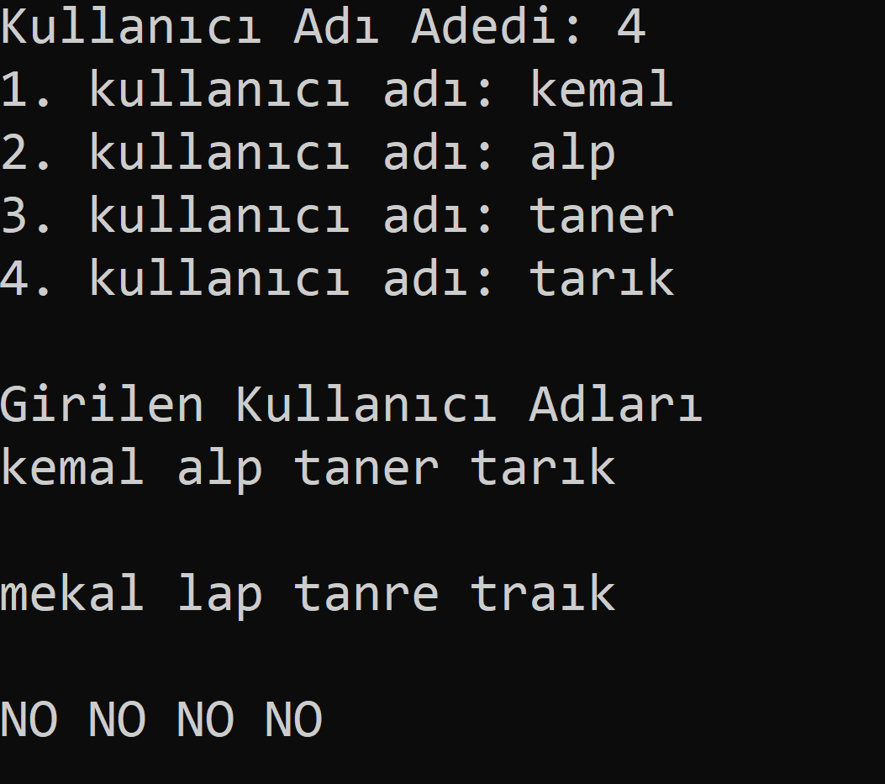

# Algorithm-Challenge
Girilen kullanıcı adlarının iki harfi yer değiştirme hakkı var. Örneğin "Alp" kullanıcı adında "l" ve "A" yer değiştirsin, yeni kullanıcı adı "lAp" olur. "lAp"  alfebetik olarak "Alp"
kullanıcın adının önündeyse ekranda Yes, değilse No yazacak  

